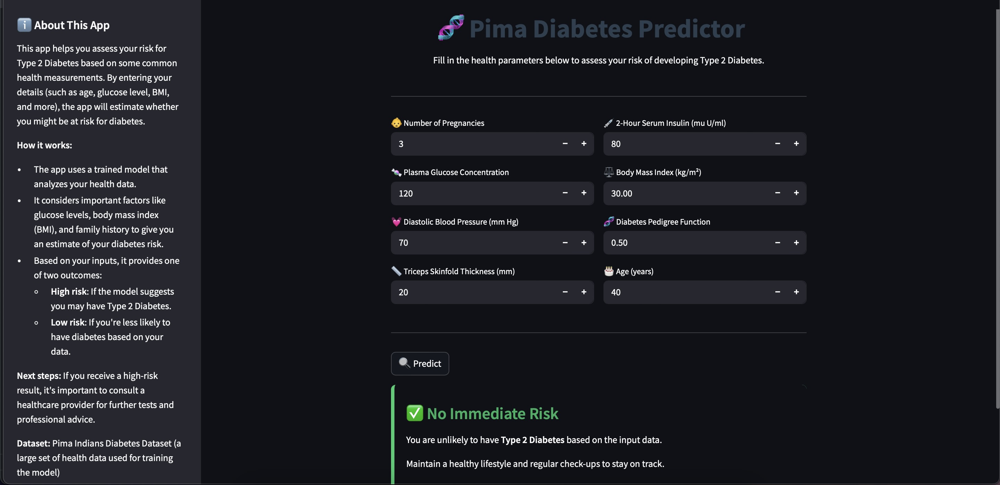

# 🩺 Pima-Diabetes-Predictor: Type 2 Diabetes Prediction Model

## 📌 Overview

This project uses machine learning algorithms to predict the presence of Type 2 diabetes in patients based on clinical measurements. The primary goal is to assist in early detection and support timely medical intervention.

Dataset used: **[Pima Indians Diabetes Dataset](https://www.kaggle.com/datasets/uciml/pima-indians-diabetes-database)**  
It includes medical predictor variables such as glucose levels, BMI, insulin, age, and family history.

---

## 🧾 Dataset Description

The dataset includes the following features:

- `Pregnancies`: Number of times pregnant  
- `Glucose`: Plasma glucose concentration  
- `BloodPressure`: Diastolic blood pressure (mm Hg)  
- `SkinThickness`: Triceps skin fold thickness (mm)  
- `Insulin`: 2-Hour serum insulin (mu U/ml)  
- `BMI`: Body Mass Index (weight in kg/(height in m)^2)  
- `DiabetesPedigreeFunction`: Diabetes pedigree function  
- `Age`: Age in years  
- `Outcome`: 1 = diabetic, 0 = non-diabetic  

---

## 🎯 Objective

To develop an accurate and interpretable machine learning model to predict current diabetes status and expose the model through a user-friendly web interface.
---

## 🧠 Models & Approach

### Models Implemented:

1. **XGBoost Classifier** 

### Workflow:
1. **Data Preprocessing**
   - Outlier handling via Winsorization
   - Feature engineering ( `HighGlucose`, `Age_BMI`)
   - SMOTE for class imbalance correction
   - Train/test split (80/20)

2. **Model Training**

3. **Evaluation Metrics**
   - Accuracy
   - Precision, Recall, F1-Score  
   - Confusion Matrix

4. **Prediction**
   - Predict diabetes presence using the trained model


---

## ✅ Results

### 📌 XGBoost (Original Test Set):
- **Accuracy**: 0.89
- **Precision (Diabetic)**: 0.81
- **Recall (Diabetic)**: 0.91
- **F1-score**: 0.85

---

## 🛠️ Installation Guide

### 1. Clone this Repository

```bash
git clone https://github.com/Ekuaappiah/pima-diabetes-predictor.git
cd pima-diabetes-predictor
```

### 2. Set Up a Virtual Environment

```bash
python3 -m venv venv
source venv/bin/activate      # macOS/Linux
venv\Scripts\activate         # Windows
```

### 3. Install Dependencies

```bash
pip install -r requirements.txt
```

### 4. Run the pipeline code for model

```bash
python pima_diabetes_pipeline.py

```

### 5. Run the App

```bash
streamlit run app.py
```

The application will launch at:  
[http://localhost:8501](http://localhost:8501)

---

## 💻 Usage

Visit the running Streamlit app to:
- Enter patient data
- View risk prediction results
- Understand model interpretation

---

## 🖼️ Screenshots



## 🔧 Tech Stack

- **Languages/Libraries**: Python, pandas, numpy, scikit-learn, xgboost, matplotlib, seaborn  
- **Web App**: Streamlit  
- **Environment**: Jupyter Notebook, Pycharm  
- **Version Control**: Git & GitHub

---

## 👤 Author

**Emmanuella – Data Scientist**  
[LinkedIn](https://www.linkedin.com/in/emmanuella-appiah-16a215213) 

---

## 📜 License

This project is licensed under the [MIT License](LICENSE).

---~~
